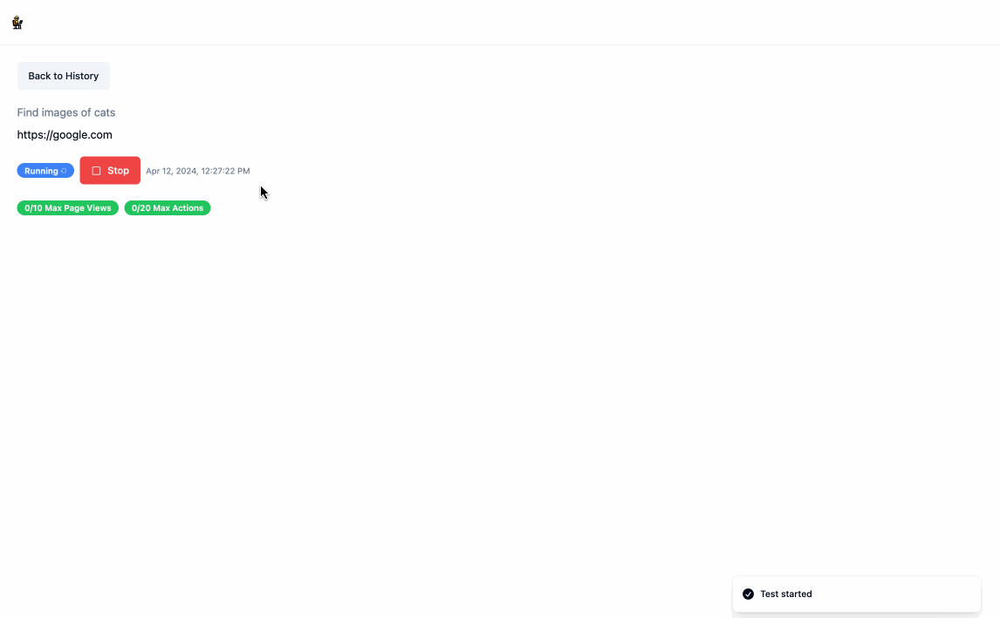
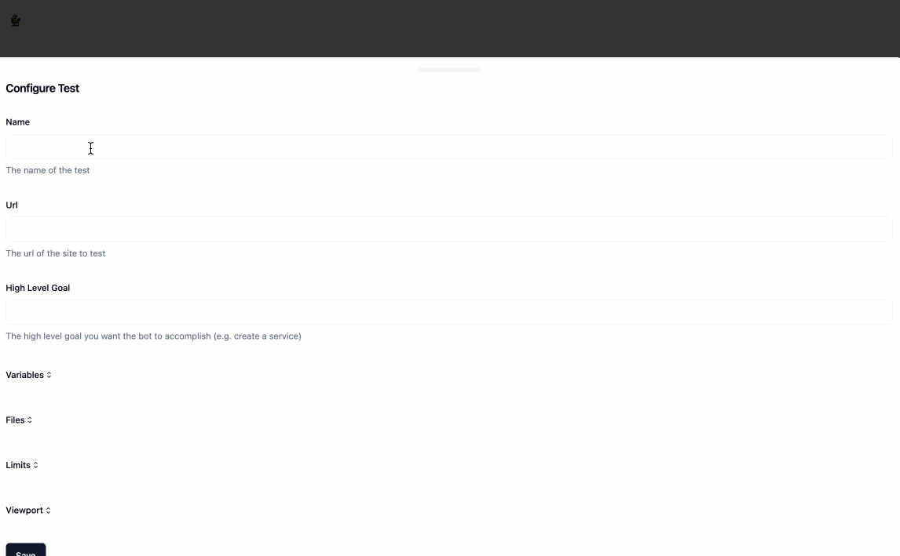
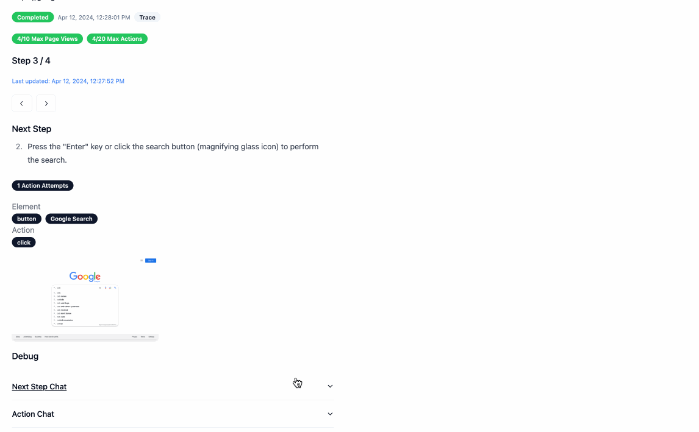

# BetaTester

BetaTester is a simple tool to help you automatically test the UI / UX of your web application on different browsers and devices without having to right brittle front-end tests. It uses LLMs to plan and select actions and [Playwright](https://playwright.dev/) to execute those actions.

As you develop and change your web application, you can specify BetaTester to continuously test high level flows like "Sign up", "Login", "Add to cart", etc. Failures can indicate either a bug in the UI or potentially non-intuitive UX, which you can investigate further using the [application](#application) or the [Playwright trace](https://playwright.dev/python/docs/trace-viewer-intro) it automatically generates.

If you don't want to keep using LLMs for every test, BetaTester [generates a scrape spec](#usage) from an LLM run that can be run deterministically.



## Contents

- [Python Package](#python-package)
- [CLI](#cli)
- [Application](#application)
- [Extensions](#extensions)
- [Debugging Prompts](#debugging-prompts)

## Python Package

### Installation

1. Install the package

```bash
pip install betatester
```

2. If you have not run Playwright before, you will need to [install the browser dependencies](https://playwright.dev/python/docs/installation#installation). This only needs to be done once per system

```bash
playwright install --with-deps chromium`
```

3. Make sure to retrieve an [your OpenAI API key](https://platform.openai.com/docs/quickstart/account-setup) if you have not already done so.

### Usage

Run the test using LLMs. See the docstring [here](./python_package/src/betatester/execution.py#L559) for more information on the avaiable parameters.

```python
from betatester import ScrapeAiExecutor
from betatester.file.local import LocalFileClient

file_client = LocalFileClient("./app-data/")

scrape_executor = ScrapeAiExecutor(
    url="https://google.com",
    high_level_goal="Find images of cats",
    openai_api_key="...",
    file_client=file_client,
)
await scrape_executor.run()
```

Run the test using a scrape spec (with no LLM calls) generated from a previous LLM run. See the docstring [here](./python_package/src/betatester/execution.py#L758) for more information on the avaiable parameters.

```python
from betatester import ScrapeSpecExecutor
from betatester.file.local import LocalFileClient

file_client = LocalFileClient("./app-data/")
scrape_spec = await file_client.load_scrape_spec("/path/to/scrape_spec.json")

scrape_spec_executor = ScrapeSpecExecutor(
    scrape_spec=scrape_spec,
)
await scrape_spec_executor.run()
```

## CLI

### Installation

1. Install the package

```bash
pip install betatester[cli]
```

2. If you have not run Playwright before, you will need to [install the browser dependencies](https://playwright.dev/python/docs/installation#installation). This only needs to be done once per system

```bash
playwright install --with-deps chromium`
```

3. Make sure to retrieve an [your OpenAI API key](https://platform.openai.com/docs/quickstart/account-setup) if you have not already done so and set it as an environment variable `OPENAI_API_KEY`.

### Usage

Run the test using LLMs. Use `betatester start_ai --help` for more information on the avaiable parameters.

```bash
FILE_CLIENT_CONFIG='{"save_path": "./app-data/"}' betatester start_ai --url "https://google.com" --high-level-goal "Find images of cats" --file-client-type "local"
```

Run the test using a scrape spec (with no LLM calls) generated from a previous LLM run. Use `betatester start_spec --help` for more information on the avaiable parameters.

```bash
FILE_CLIENT_CONFIG='{"save_path": "./app-data/"}' betatester start_spec --scrape-spec-path "/path/to/scrape_spec.json" --file-client-type "local"
```

## Application

### Quickstart

[](https://render.com/deploy?repo=https://github.com/pateli18/betatester)

**Note**: The provided render.yaml does not have a persistent disk attached, which means if the service is restarted and you are using the `local` file provider the output assets for a given test will be lost. If you want to persist this data, you will need to upgrade the instance type and [attach a persistent disk](https://docs.render.com/disks) to the service.

#### Run Locally

1. Set Environment Variables

   - **Required**: `OPENAI_API_KEY` - [Your OpenAI API key](https://platform.openai.com/docs/quickstart/account-setup)

2. Start the application

```
docker compose -f docker-compose.prod.yaml up --build
```

The application is served on [http://localhost:8080](http://localhost:8080)

#### Run Development Environment Locally

1. Set Environment Variables

   - **Required**: `OPENAI_API_KEY` - [Your OpenAI API key](https://platform.openai.com/docs/quickstart/account-setup)

2. Start the backend

```
docker compose -f docker-compose.dev.yaml up --build
```

The backend is served on [http://localhost:8080](http://localhost:8080)

3. Install frontend packages (this only needs to be done once)

```
cd frontend; npm install
```

4. Start the frontend

```
cd frontend; npm run start
```

The frontend is served on [http://localhost:3000](http://localhost:3000)

### Using the Application

1. Create a test by clicking the `New Test` button. As part of creating the test, you wiwll need to provide:

- `Name`
- `Url` - The url of the page you want to test.
- `High Level Goal`- A high level goal that the bot will try to achieve. For example, if you are testing a sign up flow, you can specify "Sign up" as the high level goal.
- [Optional] `Variables` - These are variables that can be used by the bot during the test. For example, if you have a `username` and `password` field, you can specify these as variables and the bot will automatically fill them in for you.
- [Optional] `Files` - These are files that can be used by the bot during the test. For example, if you have a file upload field, you can specify a file and the bot will automatically upload it for you.
- [Optional] `Limits` - Various settings that will ensure the bot does not infinitely loop or run for too long.
- [Optional] `Viewport` - The viewport that the bot will use to test your application.



2. Once the test is created, you can run it by clicking the `Run` button. This will redirect you to the the `/scrape` page where you can see the LLM working in real time to run the test. You can stop this process at any time by clicking `Stop`.


### Using the API

BetaTester provides a REST API for interacting with the application. The API is served on [http://localhost:8080](http://localhost:8080/api/v1). You can view the api docs at [http://localhost:8080/docs](http://localhost:8080/docs) when running the application locally.

1. [Create a Test](http://localhost:8080/docs#/config/upsert_config_api_v1_config_upsert_post)

```python
import httpx

response = httpx.post(
    "http://localhost:8080/api/v1/config/upsert",
    json={
        "name": "Test Search",
        "url": "https://google.com",
        "high_level_goal": "Find images of cats",
    }
)
config_id = response.json()["config_id"]
print(config_id)
```

2. [Start a Test](http://localhost:8080/docs#/scrape/start_scrape_api_v1_scrape_start__config__id_post)

```python
import httpx

response = httpx.post(
    f"http://localhost:8080/api/v1/scraper/start/{config_id}",
)
run_id = response.json()["scrape_id"]
print(run_id)
```

3. [Poll for Status](http://localhost:8080/docs#/process/processing_status_api_v1_scraper_status__config_id___run_id__get)

```python
import httpx
from time import sleep

while True:
    response = httpx.get(
        f"http://localhost:8080/api/v1/scraper/status/{config_id}/{run_id}"
    )
    status = response.json()["status"]
    print(status)
    if status != "running":
        break
    else:
        sleep(5)

print(response.json())
```

## Extensions

### File

AutoTransform provides a file extension that allows you to store your files in the storage provider of your choice. To use the file extension, you will need to provide the following environment variables:

- **FILE_CLIENT_TYPE**: The file client you are using, currently only `local` is supported
- **FILE_CLIENT_CONFIG**: A string that contains the configuration for your file client. The format of this object is specific to the provider you are using.
  - For `local` the format is a json obejct with the following keys:
    - **save_path**: The path to the directory where you want to store your files

You can add other file proviers by:

1. Adding a new class that inherits from [FileClient](./python_package/src/betatester/betatester_types.py#L252). See [local.py](./python_package/src/betatester/file/local.py) for an example.
2. Updating [\_\_init\_\_.py](./backend/betatester/file/__init__.py) to return your new class when the `FILE_CLIENT_TYPE` environment variable is set to the name of your new class.
3. Updating the [FileCLientType](./python_package/src/betatester/betatester_types.py#L252) enum to include your new client type

## Debugging Prompts

BetaTester will display the prompts used to run the test in the `/scrape` view. You can also continue the chat to understand why the bot made a particular decision.


